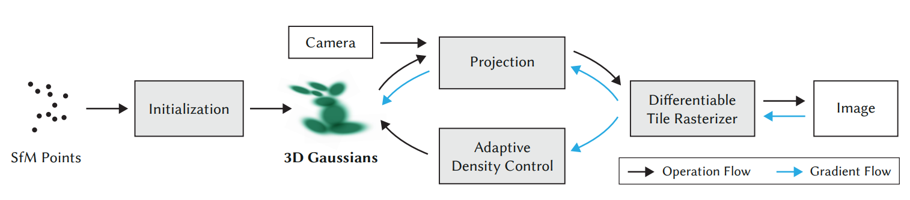
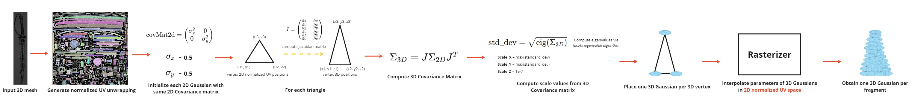
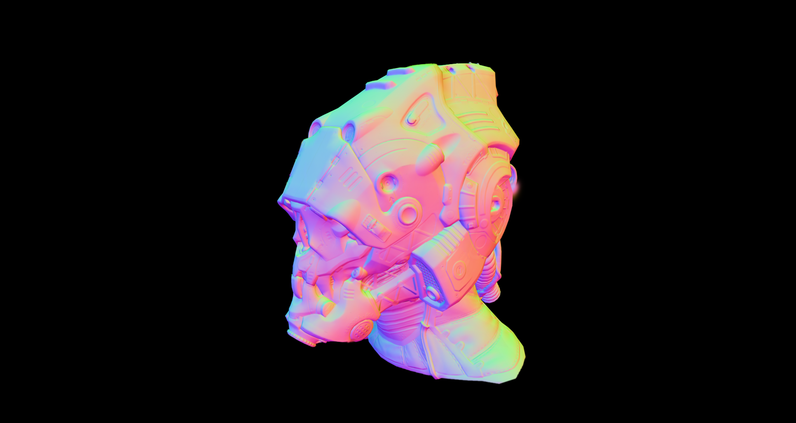
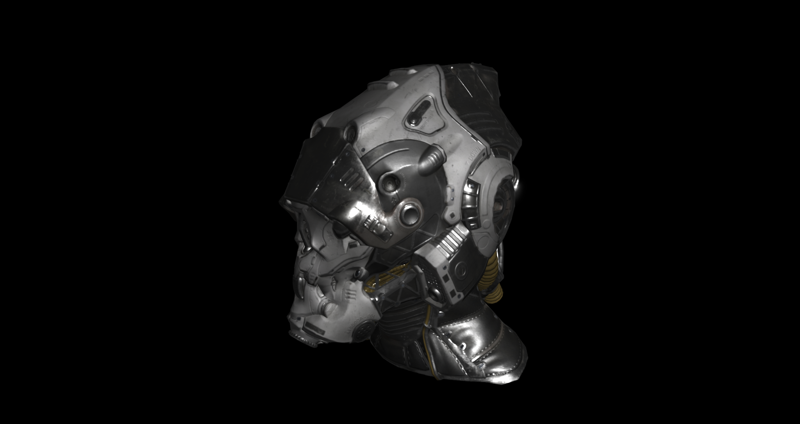
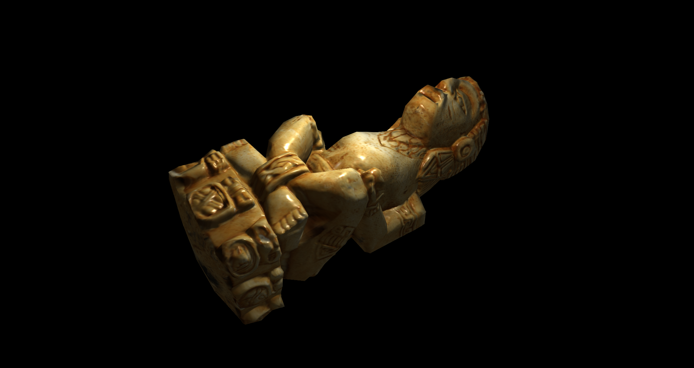
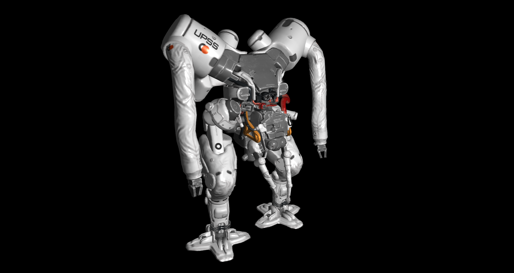
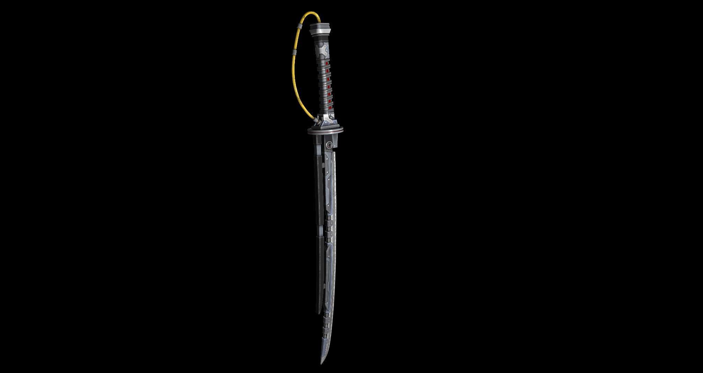

# Mesh2Splat

## Introduction
Welcome to **Mesh2Splat**, a novel approach to convert 3D meshes into 3DGS (3D Gaussian Splatting) models.<br>
3DGS was born to recontruct a photorealistic 3D representation from a series of images. This is possible thanks to an optimization process which relies on a series of reference images which are compared to 3DGS rendered scene obtained via a differentiable renderer that makes it possible to optimize a set of initial scene parameters [1].
<div align="center"> 
    
</div><br>
What if we want to represent a synthetic object (3D model) in 3DGS format rather than a real scene? Currently, the only way to do so is to generate a synthetic dataset (camera poses, renders and sparse point cloud) of the 3D model, and feed this into the 3DGS pipeline. This process can take up to 30min-45min.<br>

**Mesh2Splat** instead, by directly using the geometry, materials and texture information from the 3D model, rather than going through the classical 3DGS pipeline, is able to obtain a 3DGS representation of the input 3D models in seconds.<br>
This methodology sidesteps the need for greater interoperability between classical 3D mesh representation and the novel 3DGS format.<br>


## Method
The **pipeline** of Mesh2Splat looks as follows:
<div align="center"> 
    
</div><br>

The (current) core concept behind **Mesh2Splat** is rather simple:
- Auto-unwrap 3D mesh in **normalized UV space** (should respects relative dimensions)
- Initialize a 2D covariance matrix for our 2D Gaussians as: <br>
$`{\Sigma_{2D}} = \begin{bmatrix} \sigma^{2}_x & 0 \\\ 0 & \sigma^{2}_y \end{bmatrix}`$ <br><br> where: $`{\sigma_{x}}\sim {\sigma_{y}}\sim 0.5`$ <br>and $`{\rho} = 0`$
- Then, for each triangle primitive in the Geometry Shader stage, we do the following:
    - Compute Jacobian matrix from *normalized UV space* to *3D space* for each triangle:  $`J = V \cdot (UV)^{-1} `$.
    - Derives the 3D directions corresponding to texture axes $`u`$ and $`v`$, and calculate the magnitudes of the 3D derivative vectors.
    - Multiply the fouind lengths for by the 2D Gaussian´s standard deviation and we found our scaling factors along the directions aligned with the surface in 3D space.
    - The packed scale values will be: 
        - $`packedScale_x = log(length(Ju) * sigma_x)`$
        - $`packedScale_y = log(length(Jv) * sigma_y)`$
        - $`packedScale_z = log(1e-7)`$
    

- Now that we have the **Scale** and **Rotation** for a *3D Gaussian* part of a triangle, what we do is to emit one 3D Gaussian for each vertex of this triangle, setting their respective 3D position to the 3D position of the vertex while setting ```gl_Position = vec4(gs_in[i].normalizedUv * 2.0 - 1.0, 0.0, 1.0);```. This means that the rasterizer will interpolate these values and generate one 3D Gaussian per fragment.
- In the Fragment/Pixel Shader we can do all our texture fetches and set information regarding Metallic, Roughness, Normals, etc...
- The `.ply` file format was modified in order to account for roughness and metallic properties

## Features

- **Direct 3D Model Processing**: Directly obtain a 3DGS model from a 3D mesh.
- **Texture map support**: For now, Mesh2Splat supports the following texture maps:
    - Diffuse
    - MetallicRoughness
    - Normal
    - Ambient Occlusion (wip)
    - Emissive (wip)
- **Enhanced Performance**: Significantly reduce the time needed to transform a 3D mesh into a 3DGS.
- **Relightability**: Compared to 3DGS scenes which are already lit, the 3DGS models obtained from this method have consistent normal information and are totally unlit.

## Results
Example of result 3DGS .ply file obtained by converting a 3D mesh. The results are rendered with a PBR shader in Halcyon. 
3D mesh viewed in Blender. <br>
The resulting .ply (on the right) is rendered in [Halcyon](https://gitlab.ea.com/seed/ray-machine/halcyon)

Here You can see the FIRST IMAGE represents the true normals extracted from the rotation matrix of the 3D Gaussians, in the center are shown the normal computed by interpolating the tangent vector per vertex and retrieving the normal in tangent space from the normal map. Last image is the final 3DGS model lit in real-time with PBR (diffuse + GGX).
<table style="border-collapse: collapse; border: none;">
  <tr style="border: none;">
    <td style="border: none;"></td>
    <td style="border: none;"></td>
    <td style="border: none;"></td>
  </tr>
</table>

<br>
Following are some other 3D meshes converted into 3DGS format.
<table style="border-collapse: collapse; border: none;">
  <tr style="border: none;">
    <td style="border: none;"></td>
    <td style="border: none;"></td>
    <td style="border: none;"></td>
  </tr>
</table>

## Performance
Accurate benchmarking and comparison has not been yet performed.<br>
For now, Mesh2Splat is able to convert a 3D mesh into a 3DGS on average in **<10ms**.
<br>
If compared to current SOTA pipelines, to convert any synthetic data it takes between **15mins and 1h**. 

## Usage
ATTENTION: this section is not up to date. I am currently working on an ImGui version with 3DGS rendering to preview the converted meshes into splats and tweak a set of parameters in real-time. Updated infor to come. <br>
Currently, in order to convert a 3D mesh into a 3DGS, you can either specify all the different parameters in ```src/utils/params.hpp```, or run the executable and pass the following arguments:
- **-r**: resolution target (avoid larger than 2048), higher the resolution target, higher the quality
- **-f**: file location of the 3D mesh in ```.gltf/.glb```  format to convert.
- **-o**: output destination where to save ```.ply```.
- **-p**: to modify the default ```1.0f``` standard deviation value for the 2d Gaussians.
Otherwise, you can directly modify the value in the ```.../params.hpp``` file.<br>

Coming to the ```src/utils/params.hpp``` in case you dont want to run the executable:
- ```OBJ_NAME```: the name of the object (will reflect both on the folder name and the .glb and texture name). Currently only `.gltf/.glb` file format is supported. The name of the folder and model has to be the same (I know, I need to change this).
<br><br>**NOTE**:<br>
In order for **Mesh2Spat** to work, and convert, for example, a `robot.glb` mesh file, saved in the `.../robot/` folder, you could run the following command from the *terminal*:<br>
```Converter.exe -f <yourPath>\robot\robot.glb -r 2048 -o <yourPath>\robot\``` <br>
Then, for the moment, the code expects the following folder structure (do not nest your textures in subfolders):<br>
```
robot/
│  ├─ robot.<glb/gltf>
│  ├─ texture_diffuse_x.<png/jpeg/etc.>
│  ├─ texture_metallicRoughness_x.<png/jpeg/etc.>
│  ├─ texture_normal_x.<png/jpeg/etc.>
│
```
**Naming of the textures is not important**, but make sure they are in the same folder as the `.gltf/.glb` 3D model you are converting.

## Limitations
- Volumetric Data such as foliage, grass, hair, clouds, etc. has currently no way of being efficiently and correctly converted to 3DGS.<br>
*Mesh2Splat* is works great to reconstruct triangle-based surface meshes.

## Known issues
- **jpg format**: if using Blender and UV mapping with a ```.jpg``` texture, it will save it's `mimetype` as ```.jpeg```, invalidating some preliminary code I wrote. Just save it as ```.jpeg```, as it is equivalent to ```.jpg```


## Roadmap
- **Explore better sampling strategies**: I want to improve an explore better sampling strategies in order to maximize gaussian coverage while also limiting wasted details. 
- **View-Dependent Accuracy**: Mesh2Splat is not capable of capturing view-dependant lighting effects. The main goal is to enable relighting. But embedding view-dependant effects in an efficient way without requiring the optimizer wants to be explored.
- **Volumetric Data**: As previously mentioned, this kind of data is not modelled in any way by Mesh2Splat.
- **LODs**: Currently, by adjusting the target resolution, lower quality 3DGSs will be produced. These are generated due to lower interpolation in the rasterizer, but an idea is to compute lower LODs directly from the higher quality 3DGSs via Gaussian Mixture Models.

## References

[1] Bernhard Kerbl, Georgios Kopanas, Thomas Leimkühler, & George Drettakis. (2023). 3D Gaussian Splatting for Real-Time Radiance Field Rendering.<br>
[2] Antoine Guédon, & Vincent Lepetit. (2023). SuGaR: Surface-Aligned Gaussian Splatting for Efficient 3D Mesh Reconstruction and High-Quality Mesh Rendering.<br>
[3] Joanna Waczyńska, Piotr Borycki, Sławomir Tadeja, Jacek Tabor, & Przemysław Spurek. (2024). GaMeS: Mesh-Based Adapting and Modification of Gaussian Splatting.


