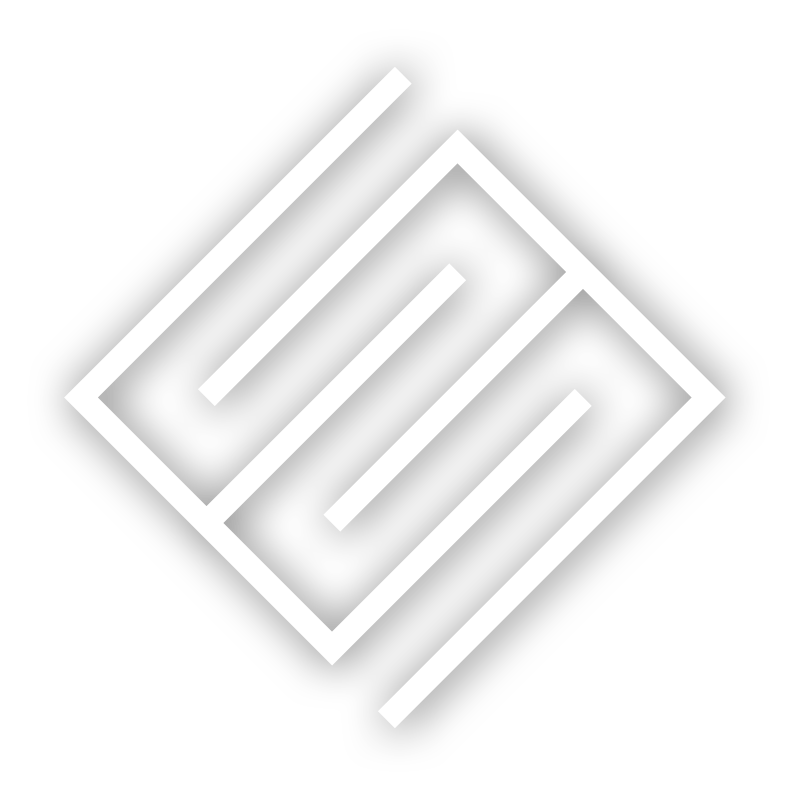

# Mesh2Splat
<div align="center">
    
</div>

**Mesh2Splat** is a fast surface splatting approach used to convert 3D meshes into 3DGS [(3D Gaussian Splatting)](https://repo-sam.inria.fr/fungraph/3d-gaussian-splatting/) models by exploiting the rasterizer's interpolator.<br>Mesh2Splat comes with a **3DGS Renderer** to view the conversion results.<p>

> "**What if we wanted to represent a synthetic object (3D model) in 3DGS format?**"

Currently, the only way to do so is to generate a synthetic dataset (camera poses, image renders and initial sparse point cloud) of the 3D model, and then feed this into the 3DGS pipeline. This process can take several minutes, depending on the specific 3DGS pipeline and model used.
<br>

**Mesh2Splat** instead, by directly using the geometry, materials and texture information from the 3D model, rather than going through the classical 3DGS pipeline, is able to obtain a 3DGS representation of the input 3D models in milliseconds.<br>

## Use Cases

**Mesh2Splat** is built for fast and flexible integration into 3D Gaussian Splatting (3DGS) workflows, especially when traditional pipelines may be too slow or incompatible with certain scenarios. Below are some key use cases:

- **3DGS-only Rendering Pipelines**  
  Some 3DGS renderers do not support hybrid rendering (i.e., mixing triangle meshes and Gaussians). In these cases, Mesh2Splat enables direct conversion of mesh assets into pure 3DGS format, allowing them to be rendered natively without relying on slower optimization pipelines.

- **Fast Initialization for 3DGS Optimization**  
  When preparing a model for a 3DGS optimization pipeline (e.g., with new sets of images or altered appearance), having a good initial guess is crucial for faster convergence and better results. Mesh2Splat provides a geometry and texture informed initialization that can be used as a strong starting point for further refinement.

- **Enhancing Traditional Renderers with Gaussian Primitives**  
  In pipelines where triangle meshes are the primary representation but 3DGS rendering is supported, Mesh2Splat can be used to convert selected assets into Gaussians. This enables developers and artists to leverage the unique properties of Gaussians.


## Features
### Converter

- **Direct 3D Model Processing**: Directly obtain a 3DGS model from a 3D mesh (only `.glb` format is supported for now).
- **Sampling density**: you can easily tweak the sampling density (conversion quality) in the settings via a slider.
- **Texture map support**: For now, Mesh2Splat supports the following texture maps:
    - Diffuse
    - Metallic-Roughness
    - Normal
- **Enhanced Performance**: Significantly reduce the time needed to transform a 3D mesh into a 3DGS.
- **Relightability**: Can easily relight the gaussians given a renderer that supports it.
<div align="center">
    
</div>

**3D model by**: M. Pavlovic, “Sci-fi helmet model,” 2024, provided by Quixel. License: CC Attribution Share Alike 3.0. (https://creativecommons.org/licenses/by-sa/3.0/.), you can download it from [here](https://github.com/KhronosGroup/glTF-Sample-Assets/tree/main/Models/SciFiHelmet/glTF)

### 3DGS Renderer

- **Visualization options**: albedo, normals, depth, geometry, overdraw and pbr properties.
- **Gaussian shading**: supports PBR based shading.
- **Lighting and shadows**: simple point light and omnidirectional shadow mapping.
- **Shader hot-reload**: if you want to experiment with the shaders and 3DGS math, hot-reload is there to make your life easier.
- **Mesh-Gaussian occlusion**: to improve performance you can use the "Enable mesh-gaussian depth test" to use the mesh as occluder in depth prepass.

<div align="center">
    
</div>

## Method
The (current) core concept behind **Mesh2Splat** is rather simple:
- Compute 3D model bounding box
- Initialize a 2D covariance matrix for our 2D Gaussians as: <br>
$`{\Sigma_{2D}} = \begin{bmatrix} \sigma^{2}_x & 0 \\\ 0 & \sigma^{2}_y \end{bmatrix}`$ <br><br> where: $`{\sigma_{x}}\sim {\sigma_{y}}\sim 0.65`$ <br>and $`{\rho} = 0`$
- Then, for each triangle primitive in the Geometry Shader stage, we do the following:
    - Apply triplanar orthogonal projection onto X,Y or Z face based on normal similarity and normalize in [-1, 1].
    - Compute Jacobian matrix from *orthogonal UV space* to *3D space* for each triangle:  $`J = V \cdot (UV)^{-1} `$.
    - Derive the 3D directions corresponding to texture axes $`u`$ and $`v`$, and calculate the magnitudes of the 3D derivative vectors.
    - Multiply the found lengths by the 2D Gaussian´s standard deviation, this way we found the scaling factors along the directions aligned with the surface in 3D space.
    - The packed scale values will be: 
        - $`packedScale_x = log(length(Ju) * sigma_x)`$
        - $`packedScale_y = log(length(Jv) * sigma_y)`$
        - $`packedScale_z = log(1e-7)`$
    

- Now that we have the **Scale** and **Rotation** for a *3D Gaussian* part of a specific triangle, emit one 3D Gaussian for each vertex of this triangle, setting their respective 3D position to the 3D position of the vertex, and in order to exploit the hardware interpolator, we set ```gl_Position = vec4(gs_in[i].normalizedUv * 2.0 - 1.0, 0.0, 1.0);```. This means that the rasterizer will interpolate these values and generate one 3D Gaussian per fragment in the orthogonal space.
- Perform texture fetches and set this data per gaussian in Fragment Shader. 
- Each fragment now atomically appends one gaussian into a shared [SSBO](https://www.khronos.org/opengl/wiki/Shader_Storage_Buffer_Object). 

## Performance
Mesh2Splat is able to convert a 3D mesh into a 3DGS on average in **<0.5ms**.
<br>


## Build Instructions (Windows)

To build **Mesh2Splat**, follow the following steps:

### Prerequisites

- **CMake ≥ 3.21.1**  
  Required to support **Visual Studio 2022** project generation. Older versions may default to unsupported generators.

- **Visual Studio 2019 or 2022**  
  Must include the **"Desktop development with C++"** workload. Make sure your CMake version is compatible with your Visual Studio version.

- **OpenGL-compatible GPU and drivers**

> 💡 If you're using Visual Studio 2022, make sure you're running CMake ≥ 3.21.1. Older versions (like 3.10 or 3.11) do **not** recognize VS 2022 and will fail to generate a solution.


### Build Steps
1. Open a terminal (`cmd` or `PowerShell`) in the project root directory.
2. Run one of the provided batch scripts:
   - `run_build_debug.bat`
   - `run_build_release.bat`
3. Open the `bin` folder and run the executable or open the `build` folder and open the `.sln` file
     
<br>

   > **Tip**: Use the release build if you only need the final executable in optimized (Release) mode.

## Build Instructions (Linux)

### Prerequisites

Install dependencies:

```bash
sudo apt install build-essential cmake pkg-config git \
    libfreeimage-dev libglew-dev libglfw3-dev libgl1-mesa-dev \
    libxinerama-dev libxcursor-dev libxi-dev libxxf86vm-dev
```

### Build Steps

1. Create and enter the build directory:
   ```bash
   mkdir build && cd build
   ```

2. Configure and build:
   ```bash
   cmake ..
   cmake --build . -j16
   ```

3. Run the executable located in the `build` directory.

<br>

   > **Tip**: Use `cmake .. -DCMAKE_BUILD_TYPE=Release` if you only need the final executable in optimized (Release) mode.


## Limitations
- Volumetric Data such as foliage, grass, hair, clouds, etc. has not being targeted and will probably not be converted correctly if using primitives different from triangles.<br>

## How to Cite
To cite this repository, click the **“Cite this repository”** button at the top of the GitHub page.  
Alternatively, you can use the following BibTeX entry:
```bibtex 
@misc{
scolari2025mesh2splat,
author = {Scolari, Stefano},
title = {Mesh2Splat: Fast mesh to 3D Gaussian splat conversion},
year = {2025}, howpublished = {\url{https://github.com/electronicarts/mesh2splat}},
note = {Extended and updated version of the author's Master's thesis at KTH.} 
}
```
This work builds upon the authors Master Thesis work:
```bibtex 
@mastersthesis{
scolari2024thesis,
author = {Scolari, Stefano},
title = {Mesh2Splat: Gaussian Splatting from 3D Geometry and Materials},
school = {KTH Royal Institute of Technology},
year = {2024},
url = {https://urn.kb.se/resolve?urn=urn:nbn:se:kth:diva-359582}
}
```

# Authors

<div align="center">
<b>Search for Extraordinary Experiences Division (SEED) - Electronic Arts
<br>
<a href="https://seed.ea.com">seed.ea.com</a>
<br>
<a href="https://seed.ea.com"></a>
<br>
SEED is a pioneering group within Electronic Arts, combining creativity with applied research.</b> <br>
We explore, build, and help define the future of interactive entertainment.
</p>

Mesh2splat is an Electronic Arts project created by [Stefano Scolari](https://www.linkedin.com/in/stefano-scolari/) for his Master's Thesis at [KTH](https://www.kth.se/en) while interning at [SEED](https://www.ea.com/seed) and supervision of Martin Mittring (Principal Rendering Engineer at [SEED](https://www.ea.com/seed)) and Christopher Peters (Professor in HCI & Computer Graphics at [KTH](https://www.kth.se/en)).

# Contributing

Before you can contribute, EA must have a Contributor License Agreement (CLA) on file that has been signed by each contributor. You can sign [here](https://electronicarts.na1.echosign.com/public/esignWidget?wid=CBFCIBAA3AAABLblqZhByHRvZqmltGtliuExmuV-WNzlaJGPhbSRg2ufuPsM3P0QmILZjLpkGslg24-UJtek*).

# License

The source code is released under an open license as detailed in [LICENSE.txt](./LICENSE.txt)


